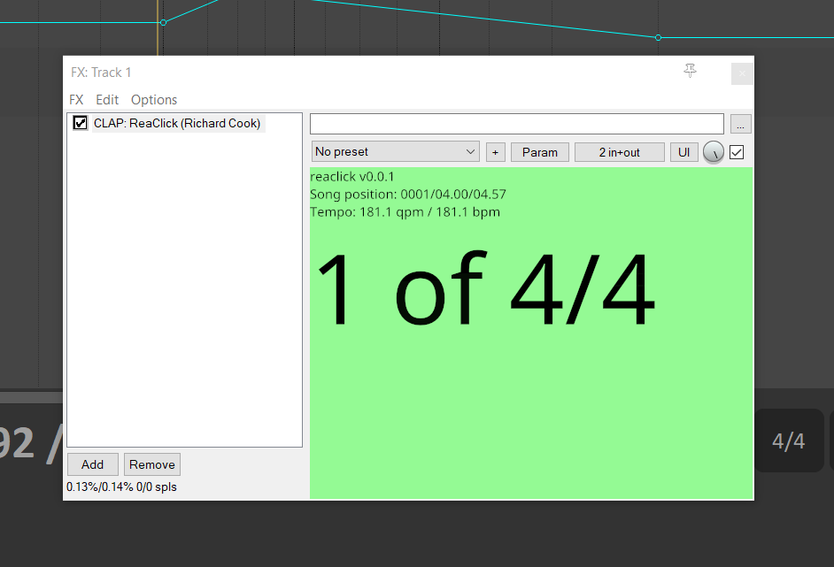

# ReaClick

ReaClick is a [CLAP][clap] click track generator plugin for CLAP hosts including
[REAPER][reaper]. I'm building this to generate signals for devices such as the
[Peterson Body Beat Pulse Solo][body-beat-pulse-solo]. This project is at the
"proof of concept" stage: it generates an audible click in time with the song etc.

_Note that this plugin has only been tested thoroughly(ish) on Windows running
 under REAPER. I am keen to see how it fares on other platforms and in other
 hosts._

Making a strong case for being the world's ugliest plugin&hellip;

## Install plugin

1. [Download archive from GitHub][releases]
2. Verify the SHA256 checksum against the contents of the corresponding
`.sha256sum` file
3. Extract the `ReaClick.clap` file from the archive
4. Move `ReaClick.clap` to a directory on your DAW's CLAP plugin search
path

## Running inside REAPER

1. Start REAPER
2. Go to _Options \| Preferences&hellip;_
3. Go to _Plug-ins \| LV2/CLAP_
4. Add the path to your CLAP plugin directory to the list of directories
under _CLAP plug-in paths (can be multiple paths separated by semicolons)_
5. Click _Re-scan \| Re-scan CLAP paths for new/modified plug-ins_
6. Double-click in the track panel to create a new, empty track
7. Click on the _FX_ button and add an instance of _CLAP: ReaClick (Richard Cook)_

## Running inside other DAWs

Any reasonable CLAP host application should be able to run this plugin.

_[Developers][readme] \| [Issues][issues]_

[body-beat-pulse-solo]: https://www.petersontuners.com/products/bodybeatpulse/
[clap]: https://cleveraudio.org/
[issues]: https://github.com/rcook/reaclick/issues
[readme]: https://github.com/rcook/reaclick/blob/main/README.md
[reaper]: https://reaper.fm/
[releases]: https://github.com/rcook/reaclick/releases
